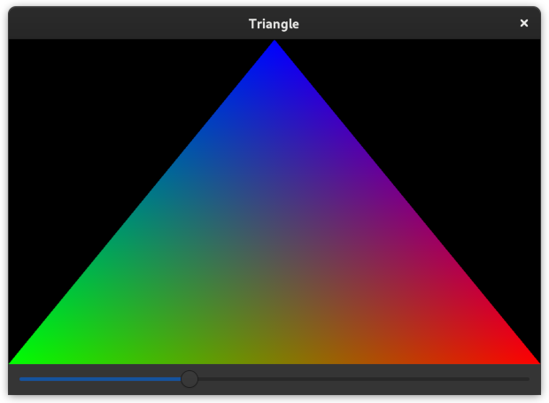

# gtk4-glium

Use [Glium](https://github.com/glium/glium) to render with OpenGL on Gtk4
windows, all in Rust.

## Example

For a complete example, see `examples/triangle.rs`.



## Quick Start

```
let facade = GtkFacade::from_glarea(&glarea);

glarea.connect_render(move |_glarea, _glcontext| {
    let context = facade.get_context();
    let mut frame = Frame::new(context.clone(), context.get_framebuffer_dimensions());

    frame.clear_color(0.0, 0.0, 0.0, 1.0);

    frame.finish().unwrap();
    Inhibit(true)
});
```
